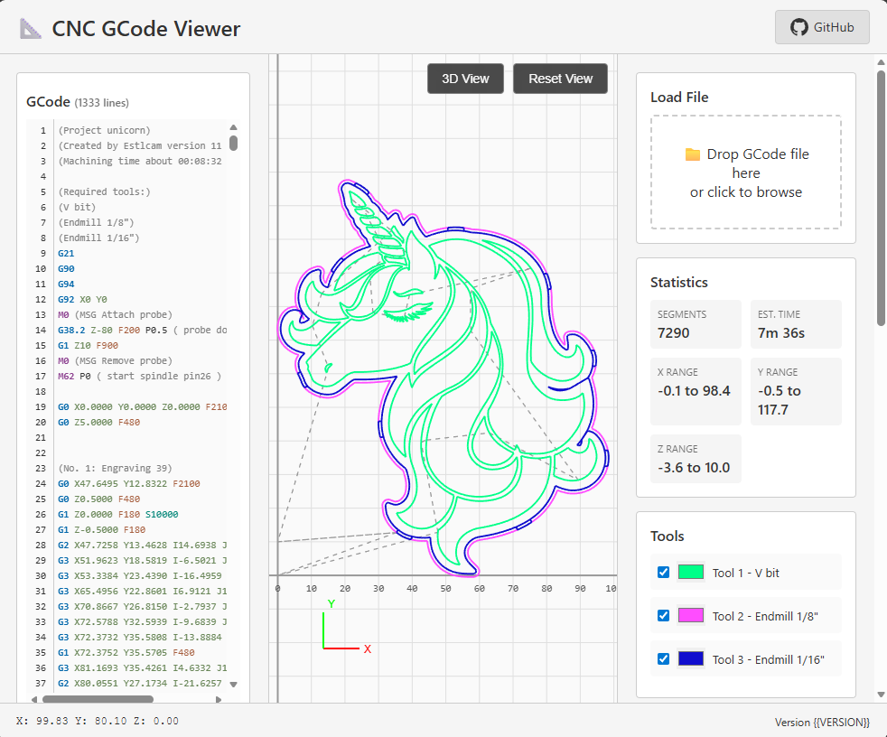
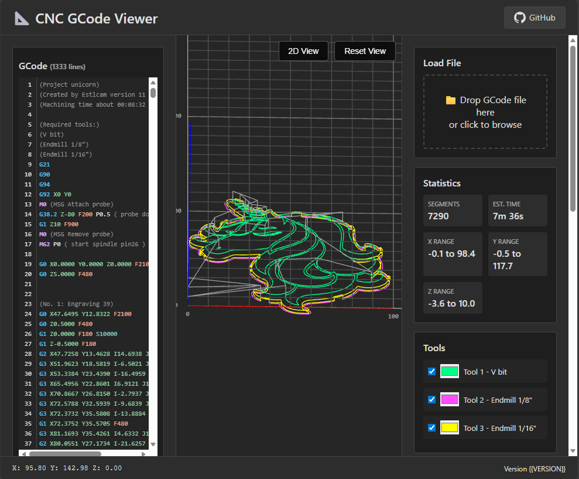

# CNC GCode Viewer


A lightweight, zero-dependency web-based CNC GCode viewer for FluidNC and GRBL CNC machines. Features both 2D and 3D visualization modes, layer-by-layer animation, multi-tool support, and runs entirely client-side on embedded devices with limited storage.

## ✨ Features

- ✅ **2D & 3D Visualization** - Switch between Canvas 2D and WebGL 3D views
- ✅ **Multi-Tool Support** - Color-coded toolpaths with individual tool visibility controls
- ✅ **Rapid Move Control** - Toggle visibility and customize color of G0 travel moves
- ✅ **Layer-by-Layer Animation** - Play, pause, and step through toolpath execution
- ✅ **Adaptive Arc Tessellation** - Smooth arc rendering with optimized segment count
- ✅ **Light & Dark Themes** - Eye-friendly themes with localStorage persistence
- ✅ **Pan, Zoom, & Rotate** - Intuitive mouse and touch controls
- ✅ **Layer Filtering** - Show/hide specific Z-height ranges
- ✅ **GCode Syntax Highlighting** - Color-coded GCode display with line numbers
- ✅ **Completely Offline** - No data transmission, all processing is local
- ✅ **Touch Optimized** - Pinch zoom, two-finger rotate/pan for tablets
- ✅ **FluidNC WebUI v3 Extension** - Custom build for FluidNC WebUI v3

## 🖼️ Screenshots


*2D visualization with grid overlay and coordinate display*


*3D WebGL rendering with orbital camera controls*

## 🚀 Quick Start

### Hosted Version
Visit the hosted version: [CNC GCode Viewer](https://jeyeager65.github.io/cnc-gcode-viewer/)

### Local Usage
1. Download `standalone.html` from the [latest release](https://github.com/jeyeager65/cnc-gcode-viewer/releases/latest)
2. Open directly in any modern browser (Chrome, Edge, Firefox, Safari)
3. Drag and drop your GCode file or use the file picker

### Embedded Device Deployment (ESP32/FluidNC)

#### Upload to Device
```bash
# Download the FluidNC-optimized gzipped file
curl -LO https://github.com/jeyeager65/cnc-gcode-viewer/releases/latest/download/gcodeviewer.html.gz

# Upload to FluidNC via web interface
curl -F "file=@gcodeviewer.html.gz" http://your-device-ip/files
```

#### Configure Web Server
FluidNC automatically serves gzipped files. Access at: `http://your-device-ip/gcodeviewer.html`

The FluidNC version includes:
- Integrated SD card file browser
- Breadcrumb navigation for folders
- Direct file preview from SD card
- Optimized for space-constrained devices

## 📊 File Sizes

| Version | Minified | Gzipped | Use Case |
|---------|----------|---------|----------|
| **Standalone** | ~65KB | **~18KB** | Local use, feature-complete |
| **FluidNC** | ~76KB | **~20KB** | FluidNC WebUI v3 Extension with SD card browser |

Both versions include:
- All visualization features (2D/3D)
- Multi-tool support with color controls
- Rapid move visibility toggle
- Animation and layer filtering
- GCode syntax highlighting

## 🎮 Usage Guide

### Loading Files

**Standalone Version:**
- **Drag & Drop**: Drag GCode files onto the upload zone
- **Browse**: Click the upload zone to select files

**FluidNC Version:**
- Browse SD card files in the file browser
- Navigate folders using breadcrumb navigation
- Click **Preview** to visualize the toolpath
- Click **Run** to execute the file on your CNC

### Tool Controls
- **Multi-Tool Jobs**: Each tool (T1, T2, etc.) gets its own color
- **Visibility Toggle**: Click tool checkboxes to show/hide specific tools
- **Color Picker**: Click color swatches to customize tool colors

### Rapid Moves (G0)
- **Visibility Toggle**: Show/hide rapid positioning moves
- **Color Control**: Customize the color of travel moves
- Useful for focusing on cutting paths only

### 2D View Controls
- **Pan**: Click and drag
- **Zoom**: Mouse wheel (zooms to cursor position)
- **Reset**: Double-click to fit view to bounds

### 3D View Controls
- **Rotate**: Click and drag to orbit camera
- **Pan**: Shift + drag to translate view
- **Zoom**: Mouse wheel to adjust distance
- **Reset**: Double-click to fit and center

### Touch Controls
- **Pan/Rotate**: Single finger drag
- **Zoom**: Pinch to zoom
- **Pan 3D**: Two-finger drag (while in 3D mode)

### Animation Controls
- **Play/Pause**: Start or stop toolpath playback
- **Reset**: Return to beginning
- **Next/Prev**: Step through line-by-line
- **Speed**: Adjust from 0.1x to 10x playback speed

### Layer Filter
- **Min Z**: Set minimum Z-height to display
- **Max Z**: Set maximum Z-height to display
- Useful for isolating specific layers in multi-layer jobs

## 🛠️ Development

### Prerequisites
- Modern web browser with WebGL support
- Text editor (VS Code, Sublime, etc.)
- Optional: Local web server for testing

### Project Structure
```
cnc-gcode-viewer/
├── src/
│   ├── index.html          # Standalone version UI
│   ├── fluidnc.html        # FluidNC version with SD browser
│   ├── js/
│   │   ├── parser.js           # GCode streaming parser
│   │   ├── camera.js           # Camera transformations
│   │   ├── renderer2d.js       # Canvas 2D renderer
│   │   ├── renderer3d.js       # WebGL renderer
│   │   ├── animator.js         # Animation controller
│   │   ├── controller.js       # Main application logic
│   │   ├── fluidnc-api.js      # FluidNC REST API client
│   │   └── fluidnc-controller.js # FluidNC-specific logic
│   └── css/
│       ├── common.css          # Shared styles
│       └── fluidnc.css         # FluidNC-specific styles
├── examples/
│   ├── simple_square.nc    # Basic G0/G1 demo
│   ├── circle_arc.nc       # G2/G3 arc demo
│   └── 3d_toolpath.nc      # Multi-layer demo
├── dist/                   # Build output (generated)
├── build.ps1              # Build script
├── localtest.ps1          # Local build & deploy (git-ignored)
├── .github/
│   └── workflows/
│       └── release.yml     # Build & release automation
├── README.md
├── LICENSE
└── CONTRIBUTING.md
```

### Local Development
```bash
# Clone repository
git clone https://github.com/jeyeager65/cnc-gcode-viewer.git
cd cnc-gcode-viewer

# Open in browser
# Simply open src/index.html or src/fluidnc.html in your browser
# Or use a local server (recommended for FluidNC version):
python -m http.server 8000
# Then visit http://localhost:8000/src/index.html or fluidnc.html
```

### Making Changes
1. Edit files in `src/` directory
2. CSS is in `src/css/` - `common.css` is shared, `fluidnc.css` is FluidNC-only
3. JavaScript is in `src/js/` - organized by functionality
4. Test in browser (refresh to see changes)
5. Check browser console for errors

### Building for Distribution
```powershell
# Local build (creates dist/ folder with both versions)
.\build.ps1

# Local build + upload to FluidNC device (customize localtest.ps1)
.\localtest.ps1
```

The build process:
- Inlines all CSS and JavaScript into single HTML files
- Minifies CSS (removes comments, whitespace)
- Minifies JavaScript with Terser (3 compression passes)
- Removes HTML comments and excess whitespace
- Creates gzipped versions for deployment
- Output: `standalone.html` and `gcodeviewer.html` (+ .gz versions)

### Building for Release
Builds are automated via GitHub Actions when you push a version tag:
```bash
git tag v1.0.0
git push origin v1.0.0
```

This automatically:
- Runs the build.ps1 script using PowerShell
- Minifies and inlines all CSS and JavaScript
- Creates both standalone and FluidNC versions
- Creates gzipped versions
- Generates changelog from commit messages
- Deploys to GitHub Pages
- Creates GitHub Release with all build artifacts

## 🌐 Browser Requirements

- **Modern Browser**: Chrome 90+, Edge 90+, Firefox 88+, Safari 14+
- **WebGL Support**: Required for 3D visualization
- **JavaScript**: ES6+ features used throughout
- **File API**: Required for file upload
- **Canvas 2D**: Required for 2D visualization

Check compatibility at: `about:gpu` (Chrome/Edge) or `about:support` (Firefox)

## 🔒 Privacy

This application is **100% client-side** and **completely offline**:
- ✅ No data is sent to any server
- ✅ No analytics or tracking
- ✅ No external dependencies or CDN calls
- ✅ All GCode processing happens in your browser
- ✅ Works without internet connection

## 📝 Supported GCode Commands

| Command | Description | Support |
|---------|-------------|---------|
| G0 | Rapid positioning | ✅ Full (with visibility toggle) |
| G1 | Linear interpolation | ✅ Full |
| G2 | Clockwise arc | ✅ Full |
| G3 | Counter-clockwise arc | ✅ Full |
| G17 | XY plane selection | ✅ Full |
| G18 | ZX plane selection | ✅ Full |
| G19 | YZ plane selection | ✅ Full |
| G20 | Inches mode | ✅ Full |
| G21 | Millimeters mode | ✅ Full |
| G90 | Absolute positioning | ✅ Full |
| G91 | Relative positioning | ✅ Full |
| T | Tool selection | ✅ Multi-tool support with colors |
| M3/M4/M5 | Spindle control | ⚠️ Parsed, not visualized |
| F | Feed rate | ✅ Used in time calculation |

## 🤝 Contributing

Contributions are welcome! Please see [CONTRIBUTING.md](CONTRIBUTING.md) for guidelines.

## 📄 License

This project is licensed under the MIT License - see the [LICENSE](LICENSE) file for details.

## 🙏 Acknowledgments

- Inspired by [cncjs/gcode-parser](https://github.com/cncjs/gcode-parser)
- Arc tessellation algorithms based on LinuxCNC implementation
- UI design influenced by modern CNC control interfaces

## 📧 Contact

- **Issues**: [GitHub Issues](https://github.com/jeyeager65/cnc-gcode-viewer/issues)

---

**⭐ Star this repository if you find it useful!**
